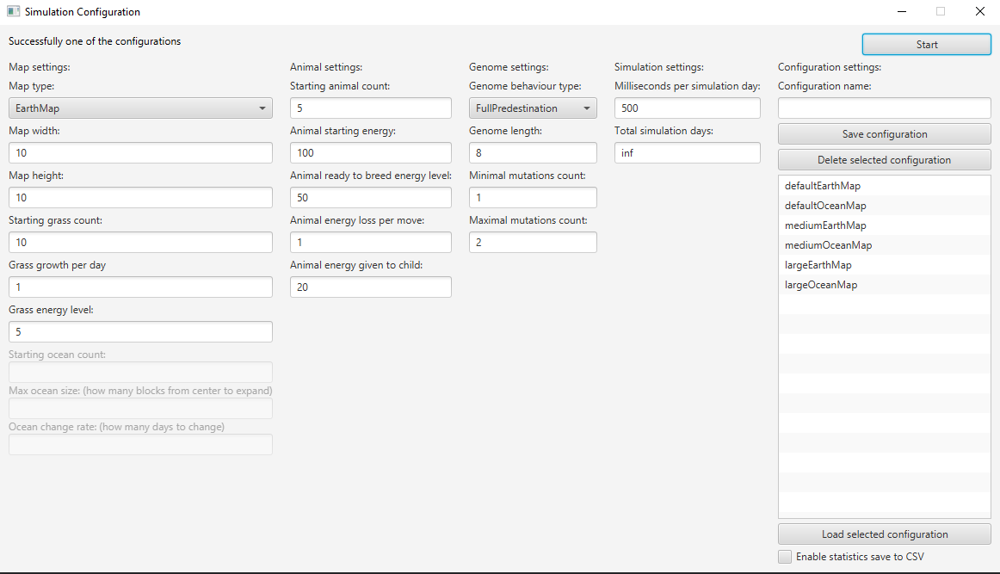
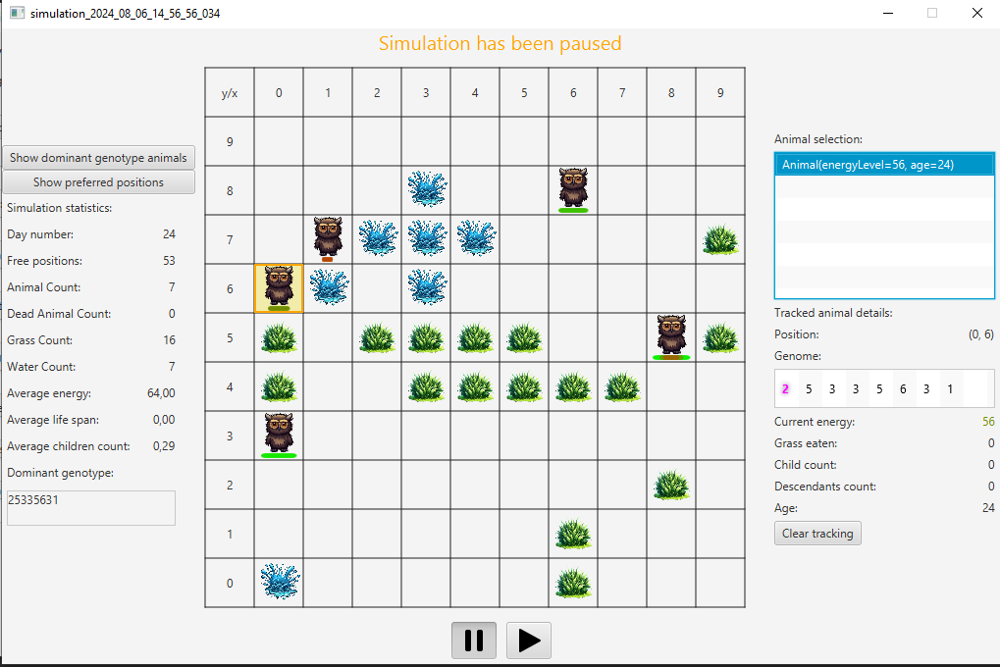
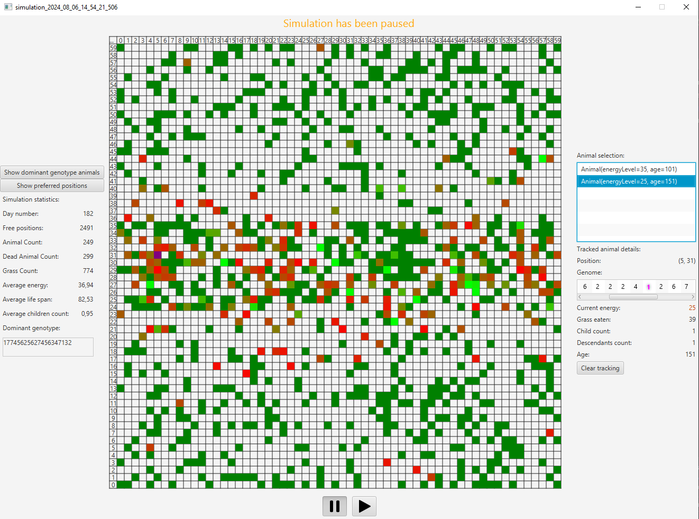

# DarwinWorld Project

1. Imię i nazwisko: Łukasz Kwinta
2. Numer grupy: Grupa nr 3 - Piątek 8:00
3. Nazwa zwierzaka: Percival

Project for OOP course. Implementation of simple genetic simulation with animals trying to survive on map.

# Usage
To build project use 
```
.\gradlew build
```
To run project use:
```
.\gradlew run 
```

All commands should be run in main repositories' directory.

# Troubleshooting
Project requires Java in version 17. You can use `java --version` in terminal to verify if you have Java JDK at version 17 installed. <br>
Gradle needs internet connection to download required dependencies:
  - `javafx` - for GUI
  - `guava` - google library helpers for streams and lists
  - `lombok` - library reducing boilerplate
  - `javatuples` - adds tuples functionality to java
  - `gson` - for json serialization and deserialization
  - `junit` - for enhanced testing functionalities, no tests currently implemented
<br>
There is a chance that you can encouter issues with configuration saving. Sometimes gradle decides to copy resource files to source again and overwrite
saved configuration. I was not able to solve the issue yet. Also configuration solving doesn't work after packing project into jar archive - jar archives are
read only.

# Screenshots



